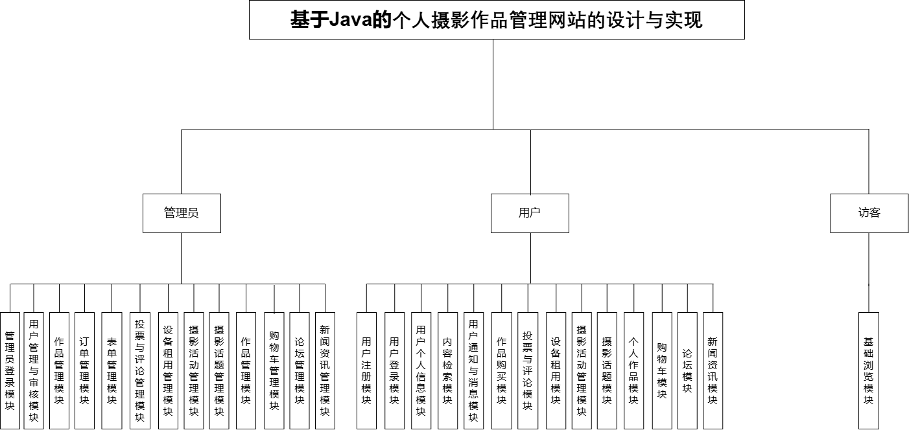

# 基于Java的个人摄影作品管理与售卖网站

## 说明

若需要使用请选择`branch`中的 `finalEdition`，`master`中为早期版本功能不够完善。

本项目为本人毕设，顺利毕业后本着互联网精神故开源、希望可以帮到各位，可用于作业、期末设计或毕业设计，未防止本人论文被后期抽检后出现雷同现象，论文及其附属材料不予公开，只挑选部分内容进入`Readme`中以供各位参考。

### 项目开发情况

+ 前后端分类部署
  + 前端`HTML`、`css`、`JS`、`VUE`
  + 后端`Java`、`SpingBoot框架`
  + 实现支付宝沙箱模拟支付（微信、银联等如需请自行配置），除支付宝外其他支付方式系统中为模拟支付

## 论文/项目提纲

第一章 概述,行业现状出发，指出当前摄影平台普遍存在抽成高、支付方式受限、本土化服务不足等问题，影响创作者收益与体验。为此，本文提出构建一个低成本、高效率、便捷操作的个人摄影作品管理平台，满足自主定价、安全交易和多样支付需求。通过对国内外主流平台的技术架构与商业模式对比，发现多数研究偏重电商或大规模图库管理，缺乏面向个人摄影师的小微服务方案，奠定了系统设计的理论基础。

第二章 系统分析，介绍项目开发环境及技术选型。开发使用IntelliJ IDEA与 Maven；架构采用 B/S 模式，提升兼容与维护性；后端基于Spring Boot与 Java，实现模块化、安全控制及高并发；MySQL 负责数据持久化，通过事务与索引优化提升性能；前端以 Vue.js 组件化开发，增强交互与体验。整套技术栈支持快速迭代与功能扩展。

第三章 系统需求分析,本章从用户体验与技术实现出发，论证平台在易用性、安全性和可维护性上的需求，评估技术可行性、成本与操作便捷性。系统角色分为管理员与普通用户，前者负责审核、管理与维护，后者则进行作品上传与交易。

第四章 系统设计与实现,系统采用模块化设计，核心功能包括用户、作品、订单与结算管理。流程图展示登录、权限分配与数据交互逻辑。数据库基于 E-R 模型设计，含20余张表，文中重点说明核心表结构，保障数据合理性与扩展性。

第五章 系统实现,详述各模块功能：管理员端整合权限管理、作品审核、数据看板（基于ECharts）及支付宝沙箱接入；用户端通过 Vue.js 实现动态交互，包括浏览、上传、定价与支付，确保前后端协同。

第六章 系统测试,在 Windows 与 Linux 环境下部署验证，采用黑盒测试设计多组用例，覆盖不同角色操作，测试数据以表格展示，验证系统在并发、支付与权限控制方面的稳定性与安全性。

第七章 总结与展望,系统开发的主要挑战为支付宝沙箱接入与权限细化控制，整体项目按预期完成。目前尚未引入智能推荐，未来可结合边缘计算，优化图片加载与响应性能。

## 系统概述

本系统的核心目标是优化用户体验，主要体现在摄影作品的高效管理、便捷的在线交易以及灵活的预约服务等方面。技术选型上，集成了Java编程语言的强大功能以确保后端业务逻辑的高效运行，MySQL数据库的高稳定性和灵活性用于保障海量数据的安全存储与快速检索，Spring Boot框架则凭借其快速开发与部署能力，显著缩短了开发周期并降低了维护成本。上述技术在全球范围内均享有高度认可，不仅在学术界的教育过程中有所涵盖，其详细资料与教程也广泛存在于网络之中，便于深入学习与实践。在开发过程中，依托这些坚实的技术基础，结合专业教师的悉心指导，任何可能遇到的技术难题都将得到有效解决，确保系统能够顺利实现既定目标，为用户带来更加流畅的使用体验。

本系统使用IDEA软件作为主要开发工具，项目管理工具为Maven，负责项目的依赖管理和构建过程，通过定义pom.xml文件统一管理所有依赖库，确保开发环境的一致性同时添加了MySQL作为数据库连接与存储工具，Navicat Premium 16提供了直观的图形化界面，支持数据库设计、数据迁移和查询优化等功能，极大简化了MySQL数据库的管理和维护工作。Tomcat则作为Web容器运行前端页面和后端Servlet，提供高效的请求处理能力。具体情况如表 2.1所示。

表 2.1 项目开发工具一览表

| 序号 | 名称              | 版本                 | 用途                 |
| ---- | ----------------- | -------------------- | -------------------- |
| 1    | Idea              | Idea 2021            | Java代码编辑与调试   |
| 2    | Maven             | apache-maven-3.6.3   | 依赖管理与自动化构建 |
| 3    | Tomcat            | apache-tomcat-8.5.34 | 运行页面和Servlet    |
| 4    | MySQL             | MySQL 5.7            | 主要关系数据存储     |
| 5    | Navicat Premium16 | 16.0.12              | 快捷访问数据库       |

本项目所使用的工具中，IDEA和Tomcat均为免费开源工具，降低了开发成本；而Navicat Premium 16为商业软件，但其强大的功能显著提升了数据库管理效率。

## 相关图表

### 用例图

#### 管理员

 管理员用例图

#### 普通用户

普通用户用例图

### 系统功能图

系统总体功能图

### 登录流程图

### 用户管理流程图

用户管理流程图

### 个人中心流程图

个人中心流程图

### 系统E-R图

系统E-R图

## 系统实现截图

### 管理员界面

管理员用户登录界面图

用户管理界面图

摄影作品管理界面图

订单管理功能及其二级子功能模块

订单的日、月、年销量及其销售额功能总体分布

日销量统计图

### 用户界面

游客系统首页展示

用户登录界面

摄影设备模块展示

个人资料模块展示

用户充值显示支付二维码弹窗

支付宝开放平台沙箱账号中商家与买家的余额状态